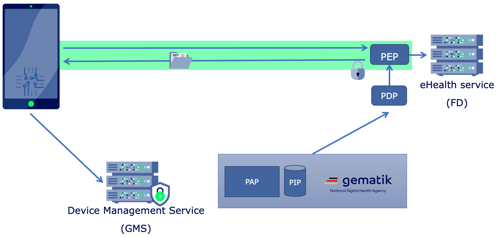

## Introduction
The Device Security Rating (DSR) is a Proof of Concept (PoC) to demonstrate the secure access to services using Zero Trust design principles. In contrast to enterprise-centric Zero Trust architectures, where devices need to be owned and/or managed by a company, the DSR PoC is designed in a way that allows participants from different legal and organisational entities without the need of giving up the ownership of their devices. 

## Project Scope
It provides the specification (in form of [DSR-RFCs]( "DSR RFCs")) and sample implementation (on GitHub) of following aspects:
* **Device Registration:** Self managed automatic registration and hardware-based identity
* **Device and App Attestation:** Sample implementation for Apple iOS and Google Android
* **Device Management Service:** Sample implementation written in Java
* **Policy Decision and Policy Enforcement Points:** Sample implementation written in Go
* **Sample Policy:** Sample policy bundle for Open Policy Agent
* **Sample Business API:** Protected by zero trust mechanisms

## Contribution and Related Work
The Device Security Rating PoC is an open-source project of the German National Digital Health Agency, [gematik GmbH](https://www.gematik.de/). It is part of the next generation German eHealth network Telematics Infrastructure (TI) 2.0 and based on the [Zero Trust concept paper](https://fachportal.gematik.de/fileadmin/Fachportal/Downloadcenter/gemKPT_Zero_Trust_V1.0.0.pdf) released in March 2023. By releasing all material to the public, gematik would like to start a dialog with the civil society and industry.

You can find the source code in the [gematik GitHub team](https://github.com/gematik):
* **[Device Management Serivce (GMS)](https://github.com/gematik/poc-dsr-gms)**
* **[Dummy Health Service (FD)](https://github.com/gematik/poc-dsr-fd)**
* **[Dummy Health Service Policy (FD Policy)](https://github.com/gematik/poc-dsr-fachdienst-policy)**
* **[Policy Enforcement Point (PEP)](https://github.com/gematik/poc-dsr-pep)**
* **Mobile Vulnerability Management (MVM)**
* **Android App / Trust Client (TCL)**
* **iOS App / Trust Client (TCL)**