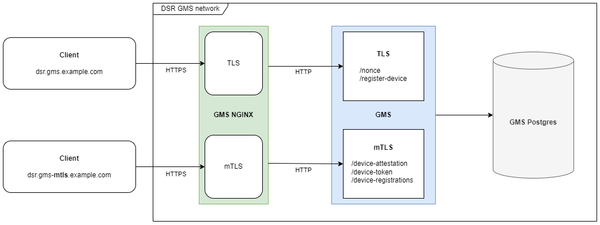

The `Device Security Rating` enables the registration, authentication and removal of devices of users to access TI resources. These functionalities are realized by the by the `Device Management Service`.  A device in this context is the specific instance of an app running on a device on which the `TrustClient` runs for secure access to the TI. A binding of the registered device to the registering user is taken into account. Examples are the registration of a device by an insured person or the registration of a health service or proxy server by a medical facility. Attacks on TI services from unregistered end devices can be limited from the outset. In addition, the user connection can be checked for access to TI services. 

 Depending on the requirements of the health service, access can, for example, be restricted to  devices that are registered for the authenticated user only. Access from devices from medical facilities could be enabled for all registered user roles (e.g., doctor, nurse, healthcare professional, ...). The `Device Management Service` uses the `device token` to provide information about the authenticated device and its execution environment to services.

## Architecture and Deployment

