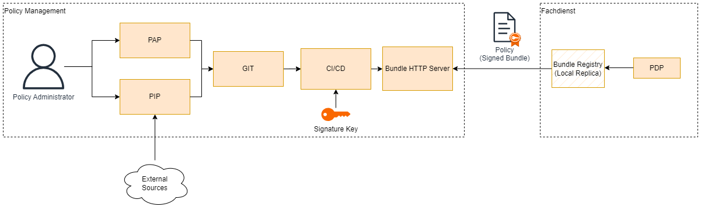

## Policy Enforcement Point (PEP)

Access to `Health Services` is only possible after successful authorization. The `Policy Enforcement Point` enforces this for each individual access to a `Health Services`, allows authorized access in the granularity of the Zero Trust resources and protects against unauthorized access. For this purpose, it passes the user, device and environment information provided by the ``Trust Client`` to the `Policy Enforcement Point` during initial authorization and expects the `Policy Enforcement Point` to make an access decision. The `Policy Enforcement Point` also provides anonymized information on access decisions and pre-processed information on suspicious access requests for monitoring purposes.

## Policy Decision Point (PDP)

The core of a Zero Trust architecture is the decision as to whether a specific user may access a specific resource at a specific time, taking into account the available information on the user, device and environment. The architecture provides a ``Policy Decision Point`` for each `Health Services` that makes this decision. This requires up-to-date and explicit guidelines that define how authenticated users, services, devices and applications may interact with each other. A ``Policy Decision Point`` therefore receives the currently valid set of rules for the relevant specialist service from the `Policy Administration Point`, determines the rules that apply to the current access and evaluates them. To do this, the ``Policy Decision Point`` determines all the information required for the evaluation, unless it is already provided by the client with the authorization request. The concept follows the Enterprise-Centric-Implementation-Model according to ISO/IEC 29146 regarding the realization of ``Policy Decision Point`` and `Policy Enforcement Point` and provides for both components within a common trust space. This can be realized by a common boundary around the specialist service and `Policy Enforcement Point`/``Policy Decision Point`` or as separate instances (e.g. IaaS components) that are coupled in a trustworthy manner.

## Realisation of PDP with Open Policy Agent

The PDP in DSR has been implemented using [Open Policy Agent (OPA)](https://www.openpolicyagent.org). On the one hand, the architecture of OPA offers numerous flexible integration scenarios (SDK, microservice, proxy); on the other hand, the policy bundles and external data can be well separated. The latter gives us great flexibility in the design and distribution of policies:

Logical policy expressions are distributed as versioned bundles via the "policy as code" approach.
Additional data necessary for the access decision can be updated separately and thus decoupled in time.
This separation allows additional assurance that only tested bundles are installed in production, while dynamic external data can be updated at runtime. OPA supports different strategies for updating external data, see https://www.openpolicyagent.org/docs/latest/external-data/.

## DSR Policy

The DSR policy consists of a list of policy rules that are dynamically evaluated for each request by the PDP. The policy is structured into different modules. This enables policy authors and domain experts to focus on specific parts of the policy. The modules are then compiled together for deployment and are provided as one policy file in form of an OPA bundle to the PDP.

The following policy modules are available:
* Device policy
    * Android
    * iOS
* Security policy

**Note**: Since the DSR Project ist not integrated into a real IDP, there is no user policy.

The device policy contains minimum requirements for users' devices before server access if allowed. Apple App Attest, Google Key & ID Attestation as well as Google Play Integrity attestation services provide different information in their attestation results – this means that different information can be verified in the policy:
* Name and version of the app (Android and iOS)
* Device model (Android and iOS)
* Minimum OS Version (Android and iOS) and security patch level (Android only)
* Attestation security level (Android only)
* Password complexity (Android only)
The security policy is used to identify access from banned IP address, countries or from banned users.

## Policy Structure
Policies habe been broken down into two seperate files. The policy file itself (available in the PAP) and the corresponding data file (PIP Data). This decision was taken with the idea that the policy file is relative static but the data file contains much more dynamic information that has to be updated reguraly.

## Policy Distribution

1. Policy bundles are created and signed via a CI/CD pipeline.
2. Bundles are published via the Bundles Registry. OPA supports OCI or plain HTTPS for this purpose.
3. The service provider replicates the policies from the bundles HTTP server to their local environment. 
4. The service administrator needs to ensure that the PDP/PEP receives the necessary policy bundles.

