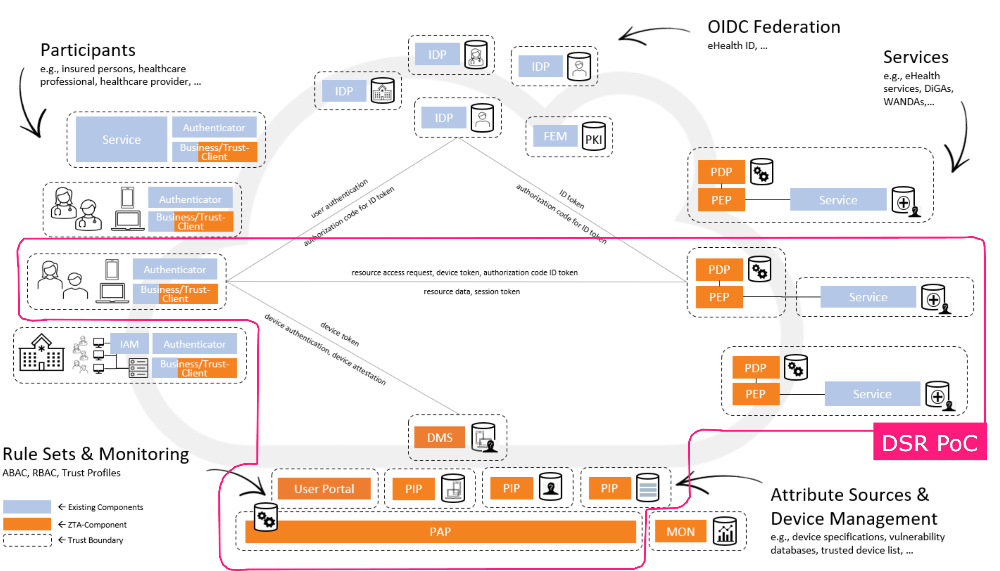

## Introduction
The goal of the Device Security Rating Proof of Concept is to demonstrate and discuss the feasibility of the central Zero Trust building blogs for the telematics infrastructure. For this reason, not all services and functionality shown in the Zero Trust architecture overview below and described in the [Zero Trust concept paper](https://fachportal.gematik.de/fileadmin/Fachportal/Downloadcenter/gemKPT_Zero_Trust_V1.0.0.pdf) are present in the PoC concept and source code. It is possible that the integration of the missing components and functionality will be investigated in a future release.

In the following sections, the current limitations of the DSR PoC will be described in detail.

## General

### Production Readiness
Since this software is not a productive version, please submit an issue or pull request for any bugs or vulnerabilities you find. In case of a responsible disclosure, please follow instructions on [https://www.gematik.de/datensicherheit#c1227](https://www.gematik.de/datensicherheit#c1227).

### Cloud Native Architecture
For our PoC, we initially focused on a bare metal runtime using Docker and Docker Compose. The Docker images are built using cloud-friendly frameworks like Quarkus and Go Gin. However, they were specifically not designed to be run as pods in a Kubernetes cluster.

Currently, we offer Nginx as the sole API gateway and TLS termination solution. Consequently, our Policy Enforcement Point (PEP) only supports this particular deployment. In production-ready cloud setups, greater flexibility is required to support Kubernetes Ingress or other cloud-native API publishing offerings.

Lastly, the configuration and secrets management should be optimized, particularly in terms of key management. This involves integration with a Key Management Service (KMS) provided by the cloud provider, ensuring more secure and efficient handling of sensitive data.

### Minimal Requirements for Trust Client Hardware
The PoC uses the latest available device attestation mechanisms. This means that an Android device with at least Android 12 (API level 31)* or an iOS device with at least iOS 14.0 is required to test the Tust Client functionality. We are aware that this excludes a large number of devices currently on the market. Possible mitigation strategies are under discussion and will be made available at a later date.

*The device must be initially released by an OEM with that version of Android. Upgraded devices do not always provide the required functionality.

## Functionality

### Trust Client for Windows / Linux / Android Derivates
The PoC is focused on mobile applications and devices. We are already evaluating attestation mechanisms provided by TPMs for desktop operating systems such as Windows and Linux. Attestation mechanisms for Android derivatives such as Huawei Harmony OS or Graphene OS will also be considered at a later stage.

### IdP Federation Integration
The user identification & authentication part of resource access provided by the IdP Federation is currently outside the scope of the PoC. As the user and device/application authentication flows are currently independent and will only be merged at the PEP, integration will be provided at a later stage.

### Monitoring, Reporting & Telemetry
Our current logging setup relies on the basic logging features provided by the web frameworks we use. We haven't yet fine-tuned this logging to capture all the detailed information needed for running such critical system.

At our Policy Enforcement Point (PEP), we use the standard logging provided by the Open Policy Agent for tracking both real and test policy enforcement. But, when we move to a production environment, we need to be more careful about our logging. We have to decide what information should be logged, especially making sure we don't log any private data. It's important to keep our data safe and private.

Also, we need to add more tools to our software to better check the system's health. This means putting telemetry - a way to measure system performance - in key parts of our system. This will help us keep a close eye on how each part is doing and maintain the system better.

### Mobile Vulnerability Management
Although the PoC includes initial work on vulnerability management for mobile devices, further research is needed.

### Device Management Service (GMS) Certificate Authority
The PoC currently uses a rudimentary CA implementation for demonstration purposes only. In a future release, this part will be enhanced with a proper framework and protocols. We are already investigating client certificate issuance based on [Automated Certificate Management Environment (ACME) Device Attestation](https://datatracker.ietf.org/doc/draft-acme-device-attest/).

### Authentication with the Electronic Health Card
The current implementation of device/application registration uses a virtual electronic health card and cannot yet be used with a physical electronic health card.

## Services & Infrastructure

### PIP & PAP
In the PoC, PIP and PAP are not yet implemented as a standalone service. This issue will be addressed at a later stage.

### User Portal
The Zero Trust concept paper describes a user portal that allows users to manage their devices and set individual settings for their interaction with the TI Zero Trust infrastructure. In the PoC, this functionality was integrated into the dummy health client for simplicity.

## Security & Privacy
Since this software is not a productive version, please submit an issue or pull request for any bugs or vulnerabilities you find. In case of a responsible disclosure, please follow instructions on [https://www.gematik.de/datensicherheit#c1227](https://www.gematik.de/datensicherheit#c1227).

### Device Management Service (GMS) Trusted Execution Environment
The Device Management Service (GMS) currently runs without enhanced isolation or sandboxing. This issue will be addressed at a later date.

### Privacy-Enhancing Measurements
Although privacy has been one of the key design principles for the PoC, the current architecture does not incorporate advanced privacy-enhancing mechanisms. This issue will be addressed at a later stage.
