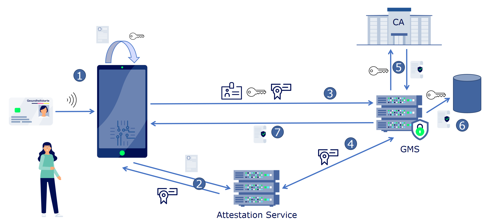

{}
Content is under development
{}

## 1. High Level Flow

1. At first start, the [`TrustClient`]() generates the [app/device identity key material]() and a corresponding [`Certificate Signing Request`](../dsr-rfc-04/#trust-client-certificate-signing-request-crl).
2. The [`TrustClient`]() then triggers the [attestation of the key material, device and app]() with the help of the `Platform Attestation Service` and receives attestation results.
3. To register the device for themself, the user signs a [Device Registration Token](../dsr-rfc-04/#device-registration-token-jwt_registration), containing the [app/device identity and attestation results]() and the [`Certificate Signing Request`](../dsr-rfc-04/#trust-client-certificate-signing-request-crl) with their electronic health card (`EF.C.CH.AUT.E256`). Then the [`TrustClient`]() sends the [Device Registration Token](../dsr-rfc-04/#device-registration-token-jwt_registration) to the `Device Management Service`.
4. With the help of the `Platform Attestation Service`, the `Device Management Service` verifies the received attestations and key material.
5. The `Device Management Service` sends the [`Certificate Signing Request`](../dsr-rfc-04/#trust-client-certificate-signing-request-crl) to the `DMS CA` which then issues a [`Trust Client Certificate`](../dsr-rfc-04/#trust-client-certificate-signing-request-crl)
6. Finally, the `Device Management Service` stores the [app/device identity key material]() with the corresponding user identity in its database.
7. The `Device Management Service` sents the [`Trust Client Certificate`](../dsr-rfc-04/#trust-client-certificate-signing-request-crl) to the [`TrustClient`]().
