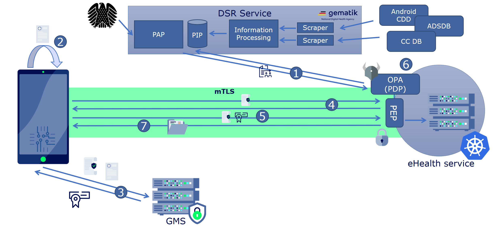

Resource access can only be performed from the previously registered and fresh attested device.

## 1. High Level Flow

1. `Policy Decision Point` regularly downloads, verifies, and installs the currently active policy from `Policy Administration Point` as well as context information from `Policy Information Point`.
2. `TrustClient` requests an attestation from the platform APIs. 
3. Attestation results are transmitted to `Device Management Service` in form of [Device Attestation Token](../dsr-rfc-04/#device-attestation-token-jwt_attest). Device Registration Service verifies the authenticity and integrity of the attestation and issues the [Device Token](../dsr-rfc-04/#device-token-device_token)
4. `TrustClient` connects to the `eHealth Service` using TLS. Mutual authentication is performed using the client certificate issued in [DSR-RFC-01]()
5. `Trust Client`sends the `Device Token` as bearer token bound to mTLS certificate or a OAuth2 Code to the eHealth Service's `PEP`. PEP verifies the authenticity of the Device Token and extracts the device information.
6. `PEP` uses device information and other available signals (e.g. HTTP request headers) as input to the `PDP`. `PDP` applies the policy against the device information and any other input provided to it by the `PEP`.
7. Once `PDP` allowed the access by making the positive decision, the `PEP` lets the eHealth Service to continue and provide resources and other functionalities to the client.

## 2. Flow Details

{}

## 2.1 Android specifics

### 2.1.1 Create Android Device Attest

### 2.1.2 Verify Android Device Attest

## 2.2 Apple specifics

### 2.2.1 Create Apple Device Attest

### 2.2.2 Verify Apple Device Attest

