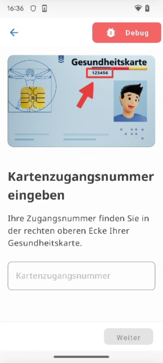
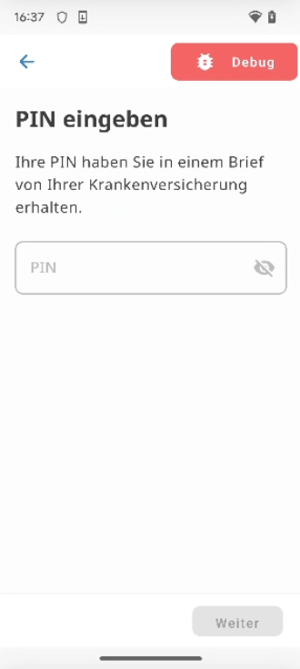
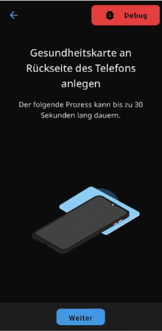
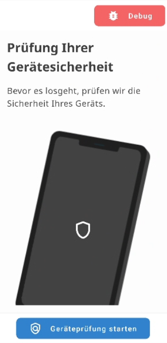
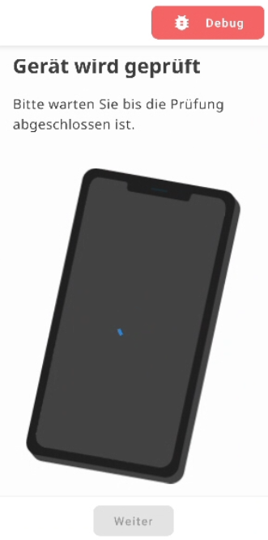
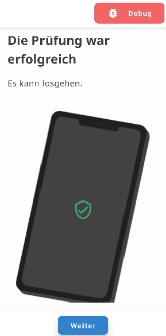
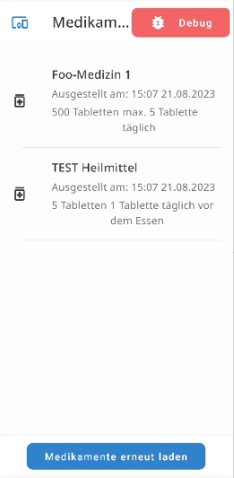

{}
Content is under development
{}

## Introduction

## Device Registration

<table>
<thead>
  <tr>
    <th><b>Step 1 - Intro</b></th>
    <th colspan="4"><b>Step 2 - User Identification</b></th>
    <th colspan="3"><b>Step 3 - Device Security Check</b></th>
    <th><b>Step 5- Main Screen</b></th>
  </tr>
</thead>
<tbody>
  <tr>
    <td>Welcome screen of the app. Informs user about device registration.</td>
    <td colspan="4">User registers herself at the IdP and her device at the GMS in one authentication step with her electronic health card</td>
    <td colspan="3">Checks if device meets requirements to use the health service.</td>
    <td>Main screen of health app.</td>
  </tr>
  <tr>
    <td> 
    
    <td></td>
    <td></td>
    <td></td>
    <td></td>
    <td></td>
    <td></td>
    <td></td>
    <td></td>
  </tr>
</tbody>
</table>

## Ressource Access

## Deletion of Registered Device