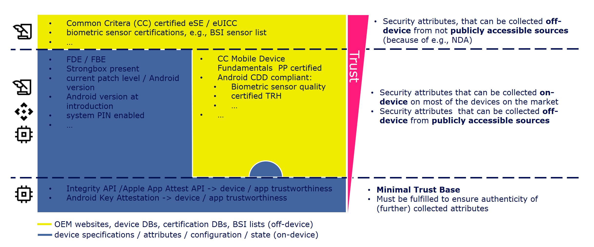

{}
Content is under development
{}

## Introduction



## Minimal Trust Base for Registration
Minimal/basic trust that is needed for a successful registration at GMS and thus for participating in the DSR. Is verified by GMS during registration process.

tbd
| Attribute | Description | API | Root of Trust | Availability |
|---|---|---|---|---|
| **Android version**  |  Android version or API level / SDK version currently running on the device |  ```Build.VERSION.SDK_INT``` | Software |  >= Android 1.6 |
| **Android version (release)**  |  Android version (API level) with which the device was released / CTS was passed |  ```getprop('ro.product.first_api_level')``` | Software | TODO |
| **Patchlevel** | OS patch level |  ```Build.VERSION.SECURITY_PATCH```  | Software | >= Android 6.0 |
| **FDE / FBE** |  Indicates whether device encryption is supported and whether it is activated. |  ```getprop('ro.crypto.state')```  | Software | TODO |
| **System PIN / password / pattern set** | Indicates whether a PIN/pattern/password is set for the lock screen. |  ```KeyguardManager.isDeviceSecure()```, ```BiometricManager.canAuthenticate(BiometricManager.Authenticators.DEVICE_CREDENTIAL)```, ```BiometricManager.canAuthenticate(BiometricManager.Authenticators.BIOMETRIC_STRONG)``` | Software | >= Android 6.0,  >= Android 11, >= Android 12 |
| **System PIN / password / pattern quality** | The Device Policy Manager can be used to query whether certain password complexity levels are currently being met. |  ```DevicePolicyManager.getPasswordComplexity()```, requires ```android.permission.REQUEST_PASSWORD_COMPLEXITY``` | Software | >= Android 10 |
| **Verified boot supported** | Indicates whether VerifiedBoot is available on the device. |  ```PackageManager.FEATURE_VERIFIED_BOOT```  | Software | >= Android 5.0  |
| **Mainline patch level** |  Indicates when the last mainline patch was installed. |  ```PackageManager.getPackageInfo("com.google.android.modulemetadata", 0).versionName``` | Software | API level > 1 |
| **OEM / model** | Returns information about manufacturer, model, etc.  |  ```BUILD.MODEL, BUILD.PRODUCT, BUILD.MANUFACTURER, BUILD.BOARD```  | Software |  |
| **Biometric class** |Returns information if class 3 biometrics is available.  |   ```BiometricManager.canAuthenticate(Authenticators#BIOMETRIC_STRONG)``` | Software | >= Android 12 |
