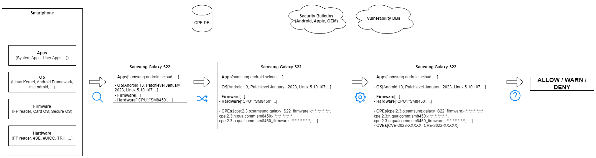

{}
Content is under development
{}

## Introduction
tbd

## Example Vulnerabilities

### Mali GPU Kernel Driver may elevate CPU RO pages to writable

|                                 |   |
|---------------------------------|---|
|__Title__                        | Mali GPU Kernel Driver may elevate CPU RO pages to writable|
|__CVEs__                         | <ol><li>CVE-2021-39793</li><li>CVE-2022-22706</li><li>CVE-2022-33917</li><li>CVE-2022-36449</li><li>(2325, 2327, 2331, 2333, 2334)</li></ol>|
|__Published__                    | Spring 2022 Summer 2022|
|__Severity__                     | MEDIUM HIGH|
|__Description__                  | A non-privileged user can get a write access to read-only memory pages; by forcing the kernel to reuse these pages as page tables, an attacker with native code execution in an app context could gain full access to the system, bypassing Android’s permissions model and allowing broad access to user data.|
|__Affected Devices__             | Devices with Mali GPU: <ul><li>Pixel</li><li>Xiaomi</li><li>Oppo</li><li>...</li></ul> |
|__Needed Information to detect__ | <ol><li>GPU manufacturer and model</li><li>Android Security Bulletin</li><ol>|
|__CPE (via NVD)__                | nn |
|__✅ Rule(s) for DSR__           | WARN all devices with MALI GPU && tbd Patchlevel |
|__References__ | https://googleprojectzero.blogspot.com/2022/11/mind-the-gap.html |

### Samsung TrustZone Keymaster

|                                 |   |
|---------------------------------|---|
|__Title__                        | Samsung TrustZone Keymaster
|__CVEs__                         | <ol><li>CVE-2021-25444</li><li>CVE-2021-25490</li></ol> |
|__Published__                    | Spring 2022 |
|__Severity__                     | HIGH |
|__Description__                  | KeyMaster in TEE: <ol><li>IV reuse attack on AES-GCM that allows an attacker to extract hardware-protected key material</li><li>downgrade attack that makes even the latest Samsung devices vulnerable to the IV reuse attack</li></ol> |
|__Affected Devices__             | <ol><li> Galaxy S8, S9, S10, S20, and S21</li><li>all Samsung devices released with < Android P</li></ol> |
|__CPE (via NVD)__                | <ol><li>`cpe:2.3:o:google:android:8.1:*:*:*:*:*:*:*; cpe:2.3:o:google:android:9.0:*:*:*:*:*:*:*; cpe:2.3:o:google:android:10.0:*:*:*:*:*:*:*`</li><li>`cpe:2.3:o:google:android:9.0:*:*:*:*:*:*:*; cpe:2.3:o:google:android:10.0:*:*:*:*:*:*:*; cpe:2.3:o:google:android:11.0:*:*:*:*:*:*:*`</li></ol> |
|__✅ Rule(s) for DSR__           | <ol><li>DENY all SAMSUNG devices with SAMSUNG_PATCHLEVEL < SMR AUG-2021 Release 1</li><li>DENY all SAMSUNG devices with SAMSUNG_PATCHLEVEL < SMR Oct-2021 Release 1</li></ol> |
|__Needed Information to detect__ | <ul><li>Samsung patch level information (ro.build.XXXX)</li><li>Samsung SMR</li></ul> |
|__References__ | <ul><li>https://eprint.iacr.org/2022/208.pdf</li><li>https://www.schneier.com/blog/archives/2022/03/samsung-encryption-flaw.html</li><li>https://security.samsungmobile.com/securityUpdate.smsb?year=2021&month=8</li></ul> |

### Internet to Baseband Remote Code Execution Vulnerabilities in Exynos Modems

|                                 |   |
|---------------------------------|---|
|__Title__                        | Internet to Baseband Remote Code Execution Vulnerabilities in Exynos Modems |
|__CVEs__                         | <ol><li>CVE-2023-24033</li><li>CVE-2023-26496</li><li>CVE-2023-26497</li><li>CVE-2023-26498</li><li>CVE-2023-26072</li><li>CVE-2023-26073</li><li>CVE-2023-26074</li><li>CVE-2023-26075</li><li>CVE-2023-26076</li><li>...</li></ol> |
|__Published__                    | Spring 2022 |
|__Severity__                     | HIGH |
|__Description__                  | KeyMaster in TEE: <ol><li>IV reuse attack on AES-GCM that allows an attacker to extract hardware-protected key material</li><li>downgrade attack that makes even the latest Samsung devices vulnerable to the IV reuse attack</li></ol> |
|__Affected Devices__             |  Devices with Exynos 1280, 2200, 5300 modem (CVE-2023-28613):<ul><li>Google Pixel 6, 7</li><li>Samsung S22, M33, M13, M12, A71, A53, A33, A21s, A13, A12 and A04 series</li><li>Vivo S16, S15, S6, X70, X60 and X30</li><li>(Exynos Auto T5123)</li></ul> |
|__Needed Information to detect__ | Devices with Exynos 1280, 2200, 5300 modem (CVE-2023-28613):<ul><li>Google Pixel 6, 7</li><li>Samsung S22, M33, M13, M12, A71, A53, A33, A21s, A13, A12 and A04 series</li><li>Vivo S16, S15, S6, X70, X60 and X30</li><li>(Exynos Auto T5123)</li></ul> |
|__CPE (via NVD)__                | <ul><li>`cpe:2.3:o:samsung:exynos_1280_firmware:-:*:*:*:*:*:*:* on cpe:2.3:o:samsung:exynos_2200_firmware:-:*:*:*:*:*:*:*`</li><li>`cpe:2.3:o:samsung:exynos_2200_firmware:-:*:*:*:*:*:*:* on cpe:2.3:h:samsung:exynos_2200:-:*:*:*:*:*:*:*`</li><li>`cpe:2.3:o:samsung:exynos_modem_5300_firmware:-:*:*:*:*:*:*:* on cpe:2.3:h:samsung:exynos_modem_5300:-:*:*:*:*:*:*:*`</li></ul> |
|__✅ Rule(s) for DSR__           | 1.-4.: allow an attacker to remotely compromise a phone at the baseband level with no user interaction, and require only that the attacker know the victim's phone number   5.-??.: require either a malicious mobile network operator or an attacker with local access to the device |
|__References__ | <ul><li>https://googleprojectzero.blogspot.com/2023/03/multiple-internet-to-baseband-remote-rce.html</li><li>https://semiconductor.samsung.com/support/quality-support/product-security-updates/</li><li>https://source.android.com/docs/security/bulletin/pixel/2023-03-01</li></ul> |

### Smartphone Fingerprint Authentication Brute-force Attack 

|                                 |   |
|---------------------------------|---|
|__Title__                        | Smartphone Fingerprint Authentication Brute-force Attack |
|__CVEs__                         | nn |
|__Published__                    | Spring 2023 |
|__Severity__                     | HIGH |
|__Description__                  | Smartphone Fingerprint Authentication to Brute-force Attack with physical access |
|__Affected Devices__             | <ul><li>Xiaomi Mi 11 Ultra (Android 11)</li><li>Vivo X60 Pro (Android 11)</li><li>OnePlus 7 Pro (Android 11)</li><li>Oppo Reno Ace (Android 10)</li><li>Samsung Galaxy  S10+ (Android 9)</li><li>OnePlus 5T (Android 8)</li><li>Huawei Mate30 Pro 5G (HarmonyOS 2)</li><li>Huawei P40 (HarmonyOS 2)</li></ul> |
|__Needed Information to detect__ | <ul><li>Android version</li><li>Android version</li></ul> |
|__CPE (via NVD)__                | nn |
|__✅ Rule(s) for DSR__           | tbd |
|__References__                   | https://arxiv.org/pdf/2305.10791.pdf |

## Implementation

The implementation of the pipeline was carried out using the following resources:
* [cpe-guesser](https://github.com/cve-search/cpe-guesser)
* [CVE search library](https://nvdlib.com/en/latest/)

The main.py file receives a list of "keywords" such as "python3 main.py samsung galaxy s6". These keywords are searched for in a local redis-server instance, which contains all CPEs from NIST.

The found CPEs are formatted properly and queried with the nvdlib at the NIST CVE API. The found CVEs are processed and outputted.